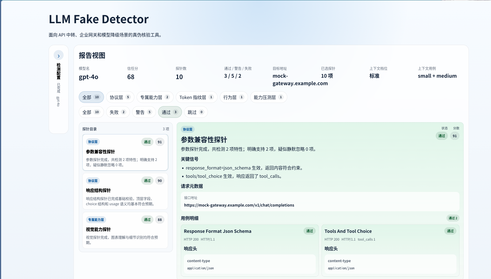

# LLM Fake Detector



面向 API 中转、企业网关和模型降级场景的真伪核验工具。

LLM Fake Detector 是一个前后端一体化的模型接口核验项目，目标是回答：

- 这个接口是不是一个成熟、稳定、可信的 `OpenAI-compatible` 实现
- 它有没有明显的协议破绽、网关伪装、能力降级或粗糙套壳痕迹
- 它声称支持的参数、工具、多模态、上下文能力，是否真实存在

前端提供检测工作台与报告视图，后端自动执行探针、汇总信任分并输出结构化证据。

## 1. 项目用途

这个项目主要面向以下场景：

- **API 中转商核验**
  判断供应商是否“挂羊头卖狗肉”，例如对外声称提供 `GPT-4o / GPT-5 / Claude / Gemini`，实际却路由到更低配模型或开源模型。
- **企业内部网关与路由校验**
  验证内部智能路由是否按预期工作，是否发生错误降级、错误分流或模型伪装。
- **协议兼容与能力核验**
  判断一个自称 `OpenAI-compatible` 的接口，到底只是能回文本，还是具备完整的参数、结构、工具、多模态与上下文能力。
- **安全与合规辅助判断**
  通过响应结构、错误语义、usage 计数、系统指纹和网关外壳特征，辅助识别异常链路与可疑第三方转发。

## 2. 方法论

项目围绕四类检测方法展开。

### 2.1 结构体与参数校验

通过协议层硬信号判断接口是否像真的上游模型能力：

- 高级参数是否真实支持，例如 `response_format=json_schema`、`tools/tool_choice`、`logprobs`
- 响应体结构是否符合常见 OpenAI 风格
- `usage` 是否完整、自洽
- `system_fingerprint`、`id`、错误对象、HTTP 版本和响应头是否存在明显破绽

### 2.2 上下文边界与压测

通过长上下文和长输出稳定性判断能力层是否存在降级：

- `Needle in a Haystack`
- 长输出格式稳定性
- 分档上下文压测：`light / standard / heavy`

### 2.3 专属能力测试

通过函数调用和视觉能力识别伪装：

- 复杂 `Function Calling`
- 多工具选择
- 图表理解
- 图片细节 / 水印识别

### 2.4 行为层测试

通过高约束输出和提示词冲突观察模型行为：

- 严格 JSON 依从
- 身份冲突测试
- 内置系统提示词探测

## 3. 当前实现

当前默认检测链路接入 **10 个顶层探针**：

1. `parameter_probe`
2. `function_calling_probe`
3. `vision_probe`
4. `gateway_signature_probe`
5. `tokenizer_probe`
6. `logprobs_probe`
7. `response_probe`
8. `behavior_probe`
9. `context_probe`
10. `error_probe`

默认注册位置：
- [backend/app/modules/detection/probes/registry.py](backend/app/modules/detection/probes/registry.py)

当前已覆盖：

- 协议层参数与结构体核验
- 错误响应审查
- 网关外壳与响应特征检查
- OpenAI / Claude / Gemini 输入 token 参考比对
- 行为层格式与提示词风险检测
- 上下文检索与长输出压测
- 函数调用与视觉能力检测
- 前端检测工作台、示例报告与结构化详情展示

## 4. 技术栈

### 后端

- `FastAPI`
- `httpx`
- `Pydantic`
- `tiktoken`
- `uvicorn`

### 前端

- `React`
- `TypeScript`
- `Vite`

## 5. 目录结构

```text
.
├── backend/
│   ├── app/
│   │   ├── api/
│   │   ├── core/
│   │   └── modules/detection/
│   │       ├── assets/
│   │       ├── prompts/
│   │       ├── probes/
│   │       ├── adapter.py
│   │       ├── schemas.py
│   │       └── service.py
│   └── pyproject.toml
├── docs/
├── frontend/
│   ├── src/
│   │   ├── app/
│   │   ├── features/detection/
│   │   ├── pages/
│   │   └── shared/
├── scripts/
├── tests/
└── README.md
```

### 关键目录说明

- `backend/app/modules/detection/probes/`
  所有探针实现都放在这里，每类能力一个文件。
- `backend/app/modules/detection/prompts/`
  探针使用的 JSON 配置与提示词定义。
- `backend/app/modules/detection/assets/`
  视觉探针等使用的资源文件。
- `frontend/src/features/detection/`
  检测请求、类型、前端探针目录和示例报告。
- `frontend/src/pages/`
  检测入口与报告视图。
- `tests/backend/`
  后端探针测试。

## 6. 快速启动

### 6.1 环境要求

- Python `>= 3.11`
- Node.js 与 npm
- 项目虚拟环境：`.venv`

### 6.2 安装后端依赖

推荐始终使用项目虚拟环境：

```bash
".venv/bin/pip" install -e "./backend"
```

### 6.3 安装前端依赖

```bash
cd "./frontend"
npm install
```

### 6.4 一键启动前后端

项目提供开发脚本：

```bash
bash "./scripts/dev.sh"
```

默认地址：

- 前端：`http://127.0.0.1:5173`
- 后端：`http://127.0.0.1:8000`

如需修改端口：

```bash
BACKEND_PORT=8010 FRONTEND_PORT=5174 bash "./scripts/dev.sh"
```

### 6.5 分别启动

后端：

```bash
PYTHONPATH="./backend" ".venv/bin/python" -m uvicorn app.main:app --reload --host 127.0.0.1 --port 8000
```

前端：

```bash
cd "./frontend"
npm run dev
```

## 7. 使用方式

### 7.1 前端页面

打开浏览器访问：

```text
http://127.0.0.1:5173
```

前端支持：

- 输入 `Base URL`
- 输入目标 `API Key`
- 输入模型名
- 选择上下文压测档位
- 勾选要运行的探针
- 为 Claude / Gemini 模型可选填写官方参考 key
- 查看结构化报告
- 使用 `加载示例报告` 快速调试前端，无需真实密钥

### 7.2 后端 API

健康检查：

```bash
curl "http://127.0.0.1:8000/api/health"
```

返回：

```json
{"status":"ok"}
```

检测接口：

```bash
curl -X POST "http://127.0.0.1:8000/api/detections/run" \
  -H "Content-Type: application/json" \
  -d '{
    "base_url": "https://example.com/v1",
    "api_key": "sk-xxx",
    "model_name": "gpt-4o",
    "enabled_probes": [],
    "context_mode": "standard",
    "reference_options": {
      "anthropic_api_key": null,
      "gemini_api_key": null
    }
  }'
```

说明：

- `enabled_probes: []` 表示运行当前默认全部探针
- `context_mode` 支持：
  - `light`
  - `standard`
  - `heavy`

## 8. 探针说明

### `parameter_probe`

用途：
- 检查高级参数是否真实支持

当前覆盖：
- `response_format=json_schema`
- `tools/tool_choice`

### `function_calling_probe`

用途：
- 检查复杂工具调用能力

当前覆盖：
- 复杂嵌套 schema
- 多工具选择

### `vision_probe`

用途：
- 检查视觉输入和图像细节识别能力

当前覆盖：
- 图表理解
- 水印 / 细节识别

### `gateway_signature_probe`

用途：
- 检查网关外壳、响应 `id`、`system_fingerprint`、`usage` 结构

适合发现：
- 粗糙 UUID 风格响应 id
- 外壳家族信号与声明模型不一致
- `usage` 结构异常

### `tokenizer_probe`

用途：
- 对比目标 `usage.prompt_tokens` 和官方参考输入 token 计数

当前支持：
- OpenAI：本地 `tiktoken`
- Claude：Anthropic 官方参考接口
- Gemini：Gemini 官方参考接口

### `logprobs_probe`

用途：
- 检查 `logprobs` / `top_logprobs` 支持情况

### `response_probe`

用途：
- 检查响应结构和常见 OpenAI-compatible 基线

### `behavior_probe`

用途：
- 检查行为层异常

当前覆盖：
- 严格 JSON 依从
- 身份冲突测试
- prompt echo 风险测试

### `context_probe`

用途：
- 检查上下文检索与长输出稳定性

当前覆盖：
- `needle_in_haystack`
- `long_output_probe`

### `error_probe`

用途：
- 检查非法请求下的错误结构与状态码语义

## 9. 前端调试

如果只是调前端页面，不想每次都输入真实密钥：

- 打开页面
- 点击 `加载示例报告`

它会直接注入一份内置 mock 结果，覆盖多种探针状态：

- `pass`
- `warn`
- `fail`
- 子项混合状态
- 结构化表格和长证据内容

对应文件：
- [frontend/src/features/detection/mockReport.ts](frontend/src/features/detection/mockReport.ts)

## 10. 测试与验证

后端语法检查：

```bash
".venv/bin/python" -m compileall "./backend/app"
```

后端测试：

```bash
PYTHONPATH="./backend" ".venv/bin/python" -m unittest discover -s "./tests/backend" -p "test_*.py"
```

前端构建验证：

```bash
cd "./frontend"
npm run build
```

## 11. 当前重点方向

项目当前重点聚焦在：

- 更高强度的上下文压测
- 更复杂的视觉与函数调用用例
- 缓存劫持、一致性与随机性探针
- 更多厂商家族的专门参考基线
- 探针并发调度与更高效的执行策略

## 12. 相关文档

- [docs/工程结构设计.md](docs/工程结构设计.md)

